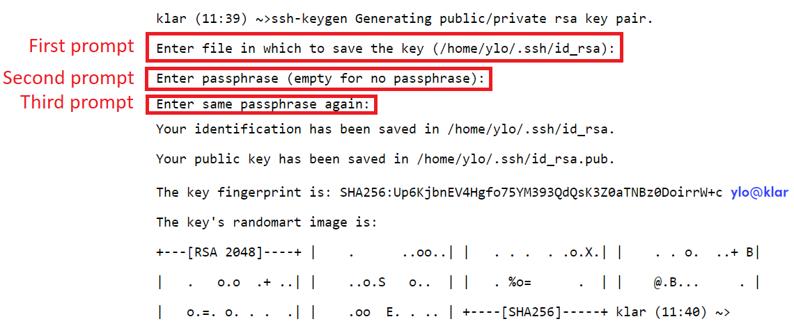
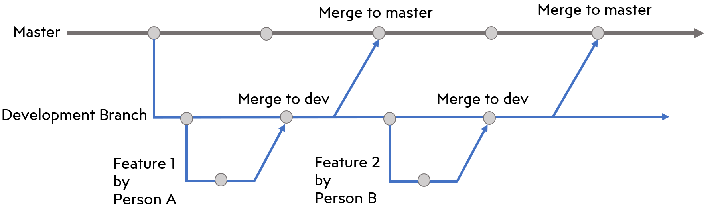

## **Download Git**
Before following any of the other steps, make sure to [download Git from here](https://git-scm.com/downloads) on your Ubuntu virtual machine.

## **Cloning the RCR Repository**
We will be cloning this repository using SSH instead of the traditional HTTPS. SSH requires us to perform a few preliminary steps, but makes pushing commits less cumbersome and is more secure in the long-run (here's an interesting [GeeksforGeeks article](https://www.geeksforgeeks.org/how-to-generate-ssh-key-with-ssh-keygen-in-linux/) that discusses the concepts at play.)

1) First, start up your Ubuntu virtual machine and run the following command in your terminal from the root directory (run `cd ~` before if you're unsure):
``` bash
ssh-keygen
```
2) You'll receive a few prompts after that, as shown in the image below. Simply press "Enter" for the first prompt, and provide a memorable password that you can remember for the second, third prompts.


3) After creating an SSH key on your Ubuntu virtual machine (or your Linux interface of choice), [add the SSH key to your GitHub account](https://docs.github.com/en/authentication/connecting-to-github-with-ssh/adding-a-new-ssh-key-to-your-github-account?platform=linux#adding-a-new-ssh-key-to-your-account).

4) Now, return to your Ubuntu virtual machine and run the following command in your root directory:
``` bash
git clone git@github.com:sbroboticsteam/robocup-rescue-23.git
```

5) If all went successfully, you can now enter your `robocup-rescue-23` repository with the following command:
``` bash
cd robocup-rescue-23
```
## **Create Your Branch**

1) In order to develop new functionality or a new feature in an organized manner, you will need to work on a separate branch (for brevity, think of a branch as a separate workspace.) If you have only cloned the repository, you will have just the main branch, so use the following command to obtain the development branch:
``` bash
git checkout -b development origin/development
```

2) You are now working in the most recent version of the development branch. Now you are going to create your own branch, which will be the only branch you are working on. Run the following command:
``` bash
git checkout -b <NAME_OF_BRANCH>
```
3) Replace `<NAME_OF_BRANCH>` with a more appropriate name. A name the concisely summarizes the feature/functionality being added will suffice.

## **Fetching and Merging Updates**
1) In order to ensure our code is up-to-date with the development branch, we will need to run the following commands. First, we will fetch code from the public RCR repository to see whether updates have been made.

``` bash
git fetch origin
```
2) If updates have been made to one or more branches, a list of those branches will be displayed in the terminal. If you see a branch of interest you want to obtain updates from (usually `origin/development` or `origin/main`), you then merge said branch into yours by running the following command:
``` bash
git merge origin/<BRANCH_OF_INTEREST>
```
3) Replace `<BRANCH_OF_INTEREST>` with the branch you are attempting to merge into your branch.

## **Branching Workflow**
This is the layout of the Git branches and an example of the workflow we will try to follow:
